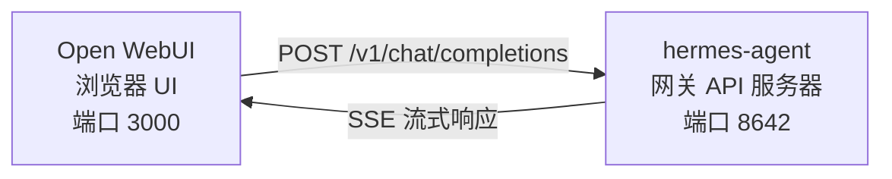

# Open WebUI 集成

[Open WebUI](https://github.com/open-webui/open-webui)（126k★）是最受欢迎的自托管 AI 聊天界面。借助 Hermes Agent 内置的 API 服务器，你可以将 Open WebUI 用作代理的精美 Web 前端 —— 配备对话管理、用户帐户和现代化聊天界面。

## 架构



Open WebUI 连接到 Hermes Agent 的 API 服务器，就像连接到 OpenAI 一样。你的代理使用其完整的工具集处理请求 —— 终端、文件操作、网络搜索、记忆、技能 —— 并返回最终响应。

Open WebUI 与 Hermes 之间是服务器到服务器的通信，因此你不需要为此集成配置 `API_SERVER_CORS_ORIGINS`。

## 快速设置

### 1. 启用 API 服务器

在 `~/.hermes/.env` 中添加：

```bash
API_SERVER_ENABLED=true
API_SERVER_KEY=your-secret-key
```

### 2. 启动 Hermes Agent 网关

```bash
hermes gateway
```

你应该看到：

```
[API Server] API server listening on http://127.0.0.1:8642
```

### 3. 启动 Open WebUI

```bash
docker run -d -p 3000:8080 \
  -e OPENAI_API_BASE_URL=http://host.docker.internal:8642/v1 \
  -e OPENAI_API_KEY=your-secret-key \
  --add-host=host.docker.internal:host-gateway \
  -v open-webui:/app/backend/data \
  --name open-webui \
  --restart always \
  ghcr.io/open-webui/open-webui:main
```

### 4. 打开界面

访问 **http://localhost:3000**。创建你的管理员帐户（第一个用户成为管理员）。你应该在模型下拉列表中看到你的代理（以你的配置文件命名，或默认配置文件为 **hermes-agent**）。开始聊天吧！

## Docker Compose 设置

对于更持久的设置，创建一个 `docker-compose.yml`：

```yaml
services:
  open-webui:
    image: ghcr.io/open-webui/open-webui:main
    ports:
      - "3000:8080"
    volumes:
      - open-webui:/app/backend/data
    environment:
      - OPENAI_API_BASE_URL=http://host.docker.internal:8642/v1
      - OPENAI_API_KEY=your-secret-key
    extra_hosts:
      - "host.docker.internal:host-gateway"
    restart: always

volumes:
  open-webui:
```

然后：

```bash
docker compose up -d
```

## 通过管理界面配置

如果你更喜欢通过界面而不是环境变量配置连接：

1. 在 **http://localhost:3000** 登录 Open WebUI
2. 点击你的**个人头像** → **Admin Settings**
3. 进入 **Connections**
4. 在 **OpenAI API** 下，点击**扳手图标**（Manage）
5. 点击 **+ Add New Connection**
6. 输入：
   - **URL**：`http://host.docker.internal:8642/v1`
   - **API Key**：你的密钥或任何非空值（例如 `not-needed`）
7. 点击**对勾**验证连接
8. **保存**

你的代理模型现在应该出现在模型下拉列表中（以你的配置文件命名，或默认配置文件为 **hermes-agent**）。

:::warning
环境变量仅在 Open WebUI **首次启动**时生效。之后，连接设置存储在其内部数据库中。要以后更改，请使用管理界面或删除 Docker 卷并重新开始。
:::

## API 类型：Chat Completions 与 Responses

Open WebUI 连接后端时支持两种 API 模式：

| 模式 | 格式 | 何时使用 |
|------|--------|-------------|
| **Chat Completions**（默认） | `/v1/chat/completions` | 推荐。开箱即用。 |
| **Responses**（实验性） | `/v1/responses` | 用于通过 `previous_response_id` 进行服务端对话状态管理。 |

### 使用 Chat Completions（推荐）

这是默认方式，不需要额外配置。Open WebUI 发送标准 OpenAI 格式的请求，Hermes Agent 相应地回复。每个请求包含完整的对话历史。

### 使用 Responses API

要使用 Responses API 模式：

1. 进入 **Admin Settings** → **Connections** → **OpenAI** → **Manage**
2. 编辑你的 hermes-agent 连接
3. 将 **API Type** 从"Chat Completions"更改为 **"Responses (Experimental)"**
4. 保存

使用 Responses API 时，Open WebUI 以 Responses 格式发送请求（`input` 数组 + `instructions`），Hermes Agent 可以通过 `previous_response_id` 跨轮次保留完整的工具调用历史。当 `stream: true` 时，Hermes 还会流式传输符合规范的 `function_call` 和 `function_call_output` 项，这可以在渲染 Responses 事件的客户端中启用自定义的结构化工具调用 UI。

:::note
Open WebUI 目前即使在 Responses 模式下也在客户端管理对话历史 —— 它在每个请求中发送完整的消息历史，而不是使用 `previous_response_id`。今天 Responses 模式的主要优势是结构化的事件流：文本增量、`function_call` 和 `function_call_output` 项以 OpenAI Responses SSE 事件而非 Chat Completions 块的形式到达。
:::

## 工作原理

当你在 Open WebUI 中发送消息时：

1. Open WebUI 发送一个 `POST /v1/chat/completions` 请求，包含你的消息和对话历史
2. Hermes Agent 创建一个具有完整工具集的 AIAgent 实例
3. 代理处理你的请求 —— 它可能调用工具（终端、文件操作、网络搜索等）
4. 随着工具执行，**内联进度消息流式传输到界面**，你可以看到代理在做什么（例如 `` `💻 ls -la` ``、`` `🔍 Python 3.12 release` ``）
5. 代理的最终文本响应流式传回 Open WebUI
6. Open WebUI 在其聊天界面中显示响应

你的代理可以访问与使用 CLI 或 Telegram 时相同的所有工具和能力 —— 唯一的区别是前端。

:::tip 工具进度
启用流式传输（默认设置）后，你会看到工具运行时的简短内联指示器 —— 工具表情和其关键参数。这些出现在代理最终回答之前的响应流中，让你了解幕后发生了什么。
:::

## 配置参考

### Hermes Agent（API 服务器）

| 变量 | 默认值 | 说明 |
|----------|---------|-------------|
| `API_SERVER_ENABLED` | `false` | 启用 API 服务器 |
| `API_SERVER_PORT` | `8642` | HTTP 服务器端口 |
| `API_SERVER_HOST` | `127.0.0.1` | 绑定地址 |
| `API_SERVER_KEY` | _(必填)_ | 认证用的 Bearer 令牌。与 `OPENAI_API_KEY` 匹配。 |

### Open WebUI

| 变量 | 说明 |
|----------|-------------|
| `OPENAI_API_BASE_URL` | Hermes Agent 的 API URL（包含 `/v1`） |
| `OPENAI_API_KEY` | 必须非空。与你的 `API_SERVER_KEY` 匹配。 |

## 故障排除

### 下拉列表中没有模型

- **检查 URL 是否有 `/v1` 后缀**：`http://host.docker.internal:8642/v1`（不只是 `:8642`）
- **验证网关是否在运行**：`curl http://localhost:8642/health` 应返回 `{"status": "ok"}`
- **检查模型列表**：`curl http://localhost:8642/v1/models` 应返回包含 `hermes-agent` 的列表
- **Docker 网络**：在 Docker 内部，`localhost` 指的是容器而非你的主机。使用 `host.docker.internal` 或 `--network=host`。

### 连接测试通过但模型未加载

这几乎总是因为缺少 `/v1` 后缀。Open WebUI 的连接测试只是基本的连通性检查 —— 它不验证模型列表是否正常工作。

### 响应时间很长

Hermes Agent 可能在产生最终响应之前执行多个工具调用（读取文件、运行命令、搜索网络）。这对于复杂查询是正常的。代理完成后响应会一次性出现。

### "Invalid API key" 错误

确保 Open WebUI 中的 `OPENAI_API_KEY` 与 Hermes Agent 中的 `API_SERVER_KEY` 匹配。

## 多用户设置与配置文件

要为每个用户运行单独的 Hermes 实例 —— 每个实例有自己的配置、记忆和技能 —— 使用[配置文件](/docs/user-guide/features/profiles)。每个配置文件在不同端口运行自己的 API 服务器，并在 Open WebUI 中自动以配置文件名称作为模型名称。

### 1. 创建配置文件并配置 API 服务器

```bash
hermes profile create alice
hermes -p alice config set API_SERVER_ENABLED true
hermes -p alice config set API_SERVER_PORT 8643
hermes -p alice config set API_SERVER_KEY alice-secret

hermes profile create bob
hermes -p bob config set API_SERVER_ENABLED true
hermes -p bob config set API_SERVER_PORT 8644
hermes -p bob config set API_SERVER_KEY bob-secret
```

### 2. 启动每个网关

```bash
hermes -p alice gateway &
hermes -p bob gateway &
```

### 3. 在 Open WebUI 中添加连接

在 **Admin Settings** → **Connections** → **OpenAI API** → **Manage** 中，为每个配置文件添加一个连接：

| 连接 | URL | API Key |
|-----------|-----|---------|
| Alice | `http://host.docker.internal:8643/v1` | `alice-secret` |
| Bob | `http://host.docker.internal:8644/v1` | `bob-secret` |

模型下拉列表将显示 `alice` 和 `bob` 作为不同的模型。你可以通过管理面板将模型分配给 Open WebUI 用户，为每个用户提供其自己的隔离 Hermes 代理。

:::tip 自定义模型名称
模型名称默认为配置文件名称。要覆盖它，请在配置文件的 `.env` 中设置 `API_SERVER_MODEL_NAME`：
```bash
hermes -p alice config set API_SERVER_MODEL_NAME "Alice's Agent"
```
:::

## Linux Docker（无 Docker Desktop）

在没有 Docker Desktop 的 Linux 上，`host.docker.internal` 默认不会解析。选项：

```bash
# 选项 1：添加主机映射
docker run --add-host=host.docker.internal:host-gateway ...

# 选项 2：使用主机网络
docker run --network=host -e OPENAI_API_BASE_URL=http://localhost:8642/v1 ...

# 选项 3：使用 Docker 网桥 IP
docker run -e OPENAI_API_BASE_URL=http://172.17.0.1:8642/v1 ...
```
